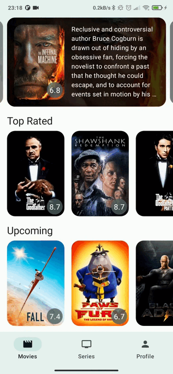
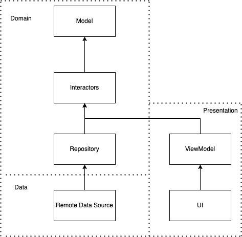

# MovieTime 🎥

MovieTime is a personal project that I use to develop architectural ideas and to learn about new technologies. Thus, it evolving and constantly changing.
The app connects to [TMDB](https://www.themoviedb.org/) API and displays Movies and Series info.

### Home
        

### Detail


## About the app
MovieTime is being developed, using:
* [Jetpack Compose](https://developer.android.com/jetpack/compose) and [Material 3](https://m3.material.io/) to build the UI
* [Kotlin Coroutines](https://kotlinlang.org/docs/coroutines-guide.html) for asynchronous operations
* [Dagger Hilt](https://dagger.dev/hilt/) for dependency injection
* [Coil](https://github.com/coil-kt/coil) for image loading
* [Accompanist](https://github.com/google/accompanist) for some utils for compose (i.e. navigation animations)

## Setup
In order to compile the project a V3 API key is required. To be able to do so, you can create an account in [TMDB](https://www.themoviedb.org/) and then go to your [profile settings](https://www.themoviedb.org/settings/api).
Once you have the API key, you can set it down in your `gradle.properties`
```
TMDB_API_KEY="YOUR_TMDB_KEY"
```

## Architecture
I follow [clean architecture](https://blog.cleancoder.com/uncle-bob/2012/08/13/the-clean-architecture.html) principles where high policy layers don't depend on details. 
This allows me to easily change the UI or the data sources without affecting the domain.

